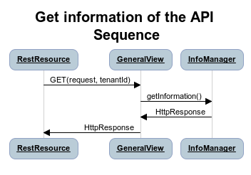
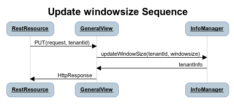
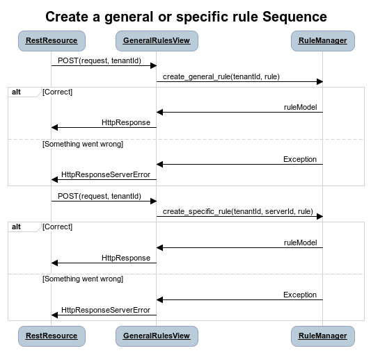
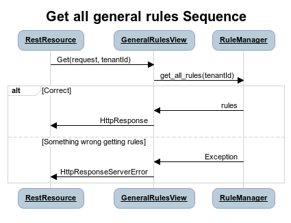
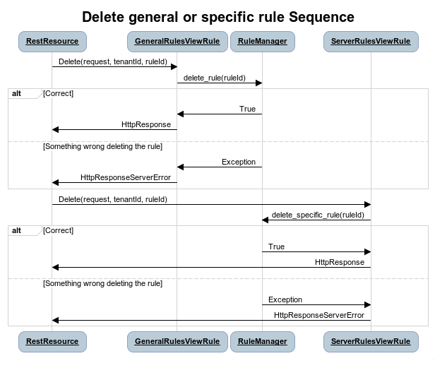
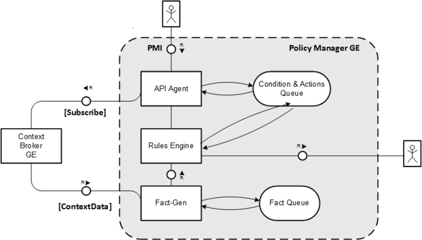
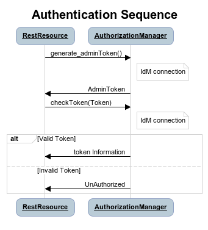

Architecture Description
________________________

Legal Notice
============

Please check the following `Legal Notice
<https://forge.fiware.org/plugins/mediawiki/wiki/fiware/index.php/FI-WARE_Open_Specification_Legal_Notice_%28implicit_patents_license%29>`_
to understand the rights to use these specifications.

Please go to GitHub's `README <https://github.com/telefonicaid/fiware-cloto/blob/master/README.rst>`_ for more
documentation.

Overview
========

This specification describes the Policy Manager GE, which is a key
enabler to scalability and to manage the cloud resources based on
defined policies or rules.

The Policy Manager GE provides the basic management of cloud resources
based on rules, as well as management of the corresponding resources
within the FIWARE Cloud Instance like actions based on physical
monitoring or infrastructure, security monitoring of resources and
services or whatever that could be defined by a facts, actions and
rules.

The baseline for the Policy Manager GE is
`PyCLIPS <http://pyclips.sourceforge.net/web/>`_, which is a module to
interface CLIPS expert system and python language. The reason to take
PyCLIPS is to extend the OpenStack ecosystem with a expert system
written in the same language that the rest of the OpenStack services.
Hence, Policy Manager offers the decision-making ability, independently
of the type of resource (physical/virtual resources, network, service or
whatever), able to solve complex problems within the Cloud field by
reasoning about the knowledge base, represented by facts and rules.

The main functionality that the Policy Manager GE provides is:

-  Management of scalability rules. It is possible to manage rules whose
   target is not to scale and this is also included in the main
   functionality of component.
-  Management of different facts related to virtual machines and other
   facts in order to launch actions from the rules whose conditions are
   met.

The Policy Manager needs interaction with the user who provides the
specification of the rules and actions that compound the knowledge
system following a CLIPS language format. The facts are received from
any producer of information that monitors the different resources of the
cloud system. Context Broker GE, like publish/subscribe/notify system,
interacts with the Policy Manager GE to suscribe to the information
(facts) of Virtual Machines or whatever in order to get updated usage
status of resources (e.g. cpu, memory, or disk) or resources that we want
to monitor. These facts are used by the inference engine to deduce new
facts based on the rules or infer new actions to take by third parties.

| |Policy Manager Enabler Architecture Overview|

.. raw:: html

   

**Policy Manager architecture specification**

.. raw:: html

   

|

Target Usage
------------

The Policy Manager GE is an expert system that provides independent
server in the OpenStack ecosystem which evaluates the current state of
the knowledge-base, applied the pertinent rules and infers new knowledge
into the knowledge-base. Currently, the actions are designed to scale up
and down Virtual Machines according to facts received from them (memory,
cpu, disk or whatever). There are more kind of usage for these rules and
is the user who defines conditions and actions he wants for. It is the
user when specify the rule and actions who specify which is the use that
we want to give to this GE.

Main concepts
=============

Following the above FMC diagram of the Policy Manager, in this section
we introduce the main concepts related to this GE through the definition
of their interfaces and components and finally an example of their use.

Basic Concepts
--------------

The Policy Manager manages a set of rules which throws actions when
certain conditions are activated when some facts are received. These
rules can be associated with a specific virtual machine or be a general
rule that affects the entire system. The key concepts, components and
interfaces associated to the Policy Manager GE and visible to the cloud
user, are described in the following subsections.

Entities
--------

The main entities managed by the Policy Manager are as follows:

-  **Rules**. They represent the policy that will be used to infer new
   facts or actions based on the facts received from the Context Broker
   GE. Usually, rules are some type of statement of the form: if then .
   The if part is the rule premise or antecedent, and the then part is
   the consequent. The rule fires when the if part is determined to be
   true or false. They are compound of 2 types of rules:

   -  **General Rules**. They represent a global policy to be considered
      regardless specific virtual machines. Each rule is compound of a
      name to identify it and the condition and action which is fired.
      GeneralRules entities are represented as RuleModel.
   -  **Specific Rules**. They represent a policy associated to a
      specific virtual machine. SpecificRules entities are represented
      as SpecificRuleModel.

-  **Information**. It represent the information about the Policy
   Manager API and tenant information. Tenant information contains the
   window size, a modificable value for manage the minimal number of
   measures to consider a real fact for Rules Engine.

-  **Facts**. They represent the measurement of the cloud resources and
   will be used to infer new facts or actions. an average of measures
   from a virtual machine trough the Context Broker GE. The are the base
   of the reasoning process.

-  **Actions**, They are the output of the knowledge system related to a
   sense input and the are the implementation of the response rule or
   consequent.

Interfaces
----------

The Policy Manager GE is currently composed of two main interfaces:

-  **The Policy Manager interface (PMI)** is the exposed REST interface
   that implements all features of the Policy Manager exposed to the
   users. The PMI allows to define new rules an actions together with
   the activation of a specific rule asociated to a resource. Besides,
   this interface allow to get the information about this GE (url
   documentation, windows size, owner and time of the last server
   start). Besides, the PMI implements the NGSI-10 interface in order to
   receive the facts provided by Context Broker (notification of the
   context data) related to a virtual server.
-  **Context Broker Manager Interface (NGSI)** is invoked in order to
   subscribe the Policy Manager to a specific monitoring resource. See
   `NGSI-10 Open RESTful API Specification
   <https://forge.fi-ware.eu/plugins/mediawiki/wiki/data/index.php/FI-WARE_NGSI-10_Open_RESTful_API_Specification_ES>`_
   for more details.

Architecture Components
-----------------------

The Policy Manager includes a data repository which keeps the rules
stored and information about the server, tenants.

-  **API-Agent (PMI)** is responsible of offering a RESTful interface to
   the Policy Manager GE users. It triggers the appropriate manager to
   handle the request.

   -  **InfoManager**, is responsible for the management of general
      information about the server running and specific tenant
      information like the window size.
   -  **RuleManager**, is responsible for the management of all related
      with general rules and rules for specified virtual machines.

-  **Rules Engine**. Is responsible for handling when a condition is
   satisfied based on the facts received and launch the associated
   actions.

   -  **RuleEngineManager**, provides management for access the rule
      engine based on CLIPS, adding the new facts to the Rule Engine and
      check rule conditions.
   -  **DbManager**, provides connection to the Data Base.

-  **Fact-Gen**, provides the mechanisms to insert facts into the rule
   Engine from context data received.

   -  **FactGenManager**, is responsible for the management of all
      related with data context build facts from this data.

-  **Condition & Actions Queue**, which contains all the rules and
   actions that can be managed by Policy Manager, including the window
   size for each tenant.
-  **Facts Queue**, which represents the actual instantiation of
   resources for a specific resource. For each element in the inventory
   (called \*-Instance), there is an equivalent in the catalogue. This
   queue is implemented with a list on a data structure server in order
   to obtain a rapid response of the system.

Example Scenario
----------------

The Policy Manager GE is involved in three different phases:

-  Management of the rules provided by users.
-  Populate rule engine with facts collected from the data context.
-  Management of rules status at runtime.

Rules Management
----------------

The management of rules involves several operations to prepare the
scalability system working. First of all, the rules have to be defined.
The definition of a rule includes the specification of the actions to be
launched, the conditions that must be inferred and a descriptive name so
user can easily recognize the rule. This rule can also be specified for
a single virtual machine.

Secondly, to get facts, it must subscribe the virtual machine to Context
Broker GE in order to receive notifications of the resources status.
Context Broker GE updates the context of each virtual machined to which
we are subscribed and the Policy Manager stores this information in a
Queue system in order to get a stable monitored value without temporal
oscillation of the signal.

Finally, the rules can be deleted or redefined. When a rule is deleted,
Policy Manager unsubscribe the virtual machine from Context Broker if
rule is a Specific Rule.

Collecting data
---------------

The Context Broker has subscribed a number of virtual machines. Each
virtual machine publishes the status of its resources in the Context
Broker GE and Policy Manager receives this notifications. After that,
Policy Manager is in charge of build facts and insert them into de Rule
Engine. When we receive a number of Facts equal to the window size, the
Policy Manager calculates the arithmetic mean of the data and insert its
value into the Rule Engine. Finally, Policy Manager discards the oldest
value in the queue.

Runtime Management
------------------

During the runtime of an application, the Policy Manager can detect if a
rule condition is inferred and is in charge of launch actions associated
with, this action will be communicated to the users that was subscribed
to this specific rule.

Main Interactions
=================

The following pictures depicts some interactions between the Policy
Manager, the Cloud Portal as main user in a typical scenario. For more
details about the Open REST API of this GE, please refer to the Open
Spec API specification.

First of all, every interaction need Authentication sequence before
starting. Authentication sequence follows like this: |Authentication
sequence|

#. If Policy Manager have requested an administration Token before it will use
   this token to validate the future token received from the Cloud Portal.
#. If an existing administration token has expired or it is the first
   initialization, the Policy Manager requests a new administration Token
   from IdM in order to validate the future token received from the Cloud Portal
   through **generate\_adminToken()** interface.

   #. The IdM returns a valid administration token that will be used to
      check the *Token* received from the Cloud Portal requested message
      through the **checkToken(Token)** interface.
   #. The IdM could return 2 options:

      #. If the *Token* is valid, the IdM returns the information related
         to this token.
      #. If the *Token* is invalid, the IdM returns the message of
         unauthorized token.

The next interactions gets information about the Policy Manager server:

   Get Information sequence

#. The User through Cloud Portal or CLI sends a GET operation to request
   information about the Policy Manager through **getInformation()**.
#. The InfoManager returns the information related to the Policy Manager
   GE associated to this tenant.

   #. Owner of the GEi.
   #. Time and date of the last wake up of the Policy Manager GE.
   #. URL of the open specification specification.
   #. Window size of the facts stabilization queue.

Following, you can see request to update the window size.

   Update Window Size sequence

#. The User through Cloud Portal or CLI sends a PUT message to the
   Policy Manager GE to update the window size of the tenantId through
   the **updateWindowSize()** message.
#. The Policy Manager returns a message with the information associated
   to this tenantId in order to confirm that the change was made.

Next, you can see the interactions to create general or specific rule
sequence

   Create general or specific rule sequence

#. The User through Cloud Portal or CLI requests a POST operation to
   create a new general/specific rule to the Policy Manager.

   #. In case of general one, the **create\_general\_rule()** interface
      is used, with params *tenantId*, the OpenStack identification of
      the tenant, and the rule description.
   #. In case of specific one, the **create\_specific\_rule()**
      interface is used, with params *tenantId*, the OpenStack
      identification of the tenant, the *serverId*, the OpenStack
      identification of the server, and the rule description.

#. The Rule Manager returns the new ruleModel associated to the new
   requested rule and the Policy Manager returns the respense to the
   user.

   #. If something was wrong, due to incorrect representation of the
      rule, a *HttpResponseServerError* is returned in order to inform
      to the user that something was wrong.

Afterward, you could see the interactions to get information about
already created general rules:

   Get all general rules sequence

#. The User through Cloud Portal or CLI requests a GET operation to the
   Policy Manager in order to receive all the general rules associated
   to a tenant through **get\_all\_rules()** interface with parameter
   *tenantId*
#. The Rule Manager component of the Policy Manager responses with the
   list of general rules.
#. If the tenant identify is wrong or whatever the Rule Manager
   responses a HttpResponseServerError.

Following, the interactions to get detailed information about getting
general or specific rule sequence.

.. figure:: resources/PM-getGeneralRule.png
   :alt: Get general or specific rule sequence

   Get general or specific rule sequence

#. The User through Cloud Portal or CLI requests a GET operation to
   recover the rules.

   #. If we decide to recover a general rule, the **get\_rule()**
      interface should be used with *ruleId* parameter
   #. Otherwise, if you decir to recover a specific rule, the
      **get\_specific\_rule()** interface should be used with the
      *ruleId* parameter.

#. The Rule Manager of the Policy Manager will return the ruleModel that
   it is stored in the Rule & Action Queue. If something was wrong,
   Policy Manager will return **HttpResponseServerError** to the user.

Next off, the interactions to delete general or specific rule.

   Delete a general or specific rule sequence

#. The User through Cloud Portal or CLI requests the deletion of a
   general or specific rule to the Policy Manager with the identity of
   the tenant and rule.

   #. The view sends the request to the RuleManager by calling the
      **delete\_rule()** interface with identity of the rule as
      parameter of this interface to delete it.
   #. Otherwise, if the rule is specific for a server, the views sends
      the request to the RuleManager by calling the
      **delete\_specific\_rule()** interface, with identity of the rule
      as parameter of this interface to delete it.

#. If the operation was ok, the RuleManager responses a *HttpResponse*
   with the ok message, by contrast, if something was wrong, it returns
   a *HttpResponseServerError* with the details of the problem.

Finally, the interactions to update a specific or general rule

.. figure:: resources/PM-updateGeneralRule.png
   :alt: Update a general or specific rule sequence

   Update a general or specific rule sequence

#. The User through Cloud Portal or CLI requests the update of a general
   or specific rule to the Policy Manager with the identity of the
   tenant and rule.

   #. The view sends the request to the RuleManager by calling the
      **update\_general\_rule()** interface with identity of the tenant
      and rule as parameters of this interface to delete it.
   #. Otherwise, if the rule is specific for a server, the views sends
      the request to the RuleManager by calling the
      **update\_specific\_rule()** interface, with identity of the
      tenant and rule as parameters of this interface to delete it.

#. If the operation was ok, the RuleManager responses with a new
   ruleModel class created and the API returns a *HttpResponse* with the
   ok message, by contrast, if something was wrong, it returns a
   *HttpResponseServerError* with the details of the problem.

Basic Design Principles
=======================

Design Principles
-----------------

The Policy Manager GE has to support the following technical
requirements:

-  The condition to fire the rule could be formulated on several facts.
-  The condition to fire the rule could be formulated on several
   interrelated facts (the values ​​of certain variables in those facts
   match).
-  User could add facts "in runtime" via API (without stop server).
-  User could add rules "in runtime" via API (without stop server).
-  That part of the implementation of the rule would:

   -  Update facts.
   -  Delete facts.
   -  Create new facts.

-  Actions can use variables used in the condition.
-  Actions implementation can invoke REST APIs.
-  Actions can send an email.
-  The Policy Manager should be integrated into the OpenStack without
   any problem.
-  The Policy Manager should interact with the IdM GE in order to offer
   authentication functionality to this GE.
-  The Policy Manager should interact with the Context Broker GE in
   order to receive monitoring information from resources.

Resolution of Technical Issues
------------------------------

When applied to Policy Manager GE, the general design principles
outlined at `Cloud Hosting Architecture
<http://forge.fi-ware.eu/plugins/mediawiki/wiki/fiware/index.php/Cloud_Hosting_Architecture>`_
can be translated into the following key design goals:

-  Rapid Elasticity, capabilities can be quickly elastically provisioned
   and released, in some cases automatically, to scale rapidly outward
   and inward commensurate with demand. To the consumer, the
   capabilities available for provisioning often appear to be unlimited
   and can be appropriated in any quantity at any time.
-  Availability, Policy Manager should be running all the time without
   interruption of the service due to the nature of itself.
-  Reliability, Policy Manager should assure that the activations of
   rule was produce by correct inference based on facts received from a
   Context Broker GE.
-  Safety, is the Policy Manager has any problem, it should continue
   working without any catastrophic consequences on the user(s) and the
   environment.
-  Integrity, Policy Manager does not allow the alteration of the facts
   queue and/or rules and actions queue.
-  Confidentiality, Policy Manager does not allow the access to facts,
   rules and actions associated to a specitic tenant.

Regarding the general design principles not covered by the Cloud Hosting
Architecture, they can be translated into the following key design goals:

-  REST based interfaces, for rules and facts.
-  The Policy Manager GE keeps stored all rules provisioned for each
   user.
-  The Policy Manager GE manage all facts and checks when actions should
   be fired.

