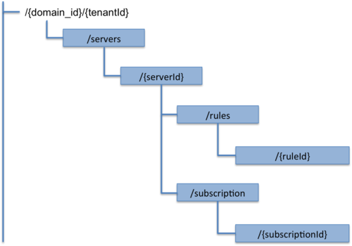

Open RESTful API Specification
______________________________

Introduction to the PMI Policy API
==================================

Please check the `FIWARE Open Specifications Legal Notice
<https://forge.fi-ware.org/plugins/mediawiki/wiki/fiware/index.php/FI-WARE_Open_Specifications_Legal_Notice>`_
to understand the rights to use FIWARE Open Specifications.

Please go to GitHub's `README <https://github.com/telefonicaid/fiware-cloto/blob/master/README.rst>`_ for more
documentation.

PMI Policy API
--------------

The PMI Policy API is a RESTful, resource-oriented API accessed via
HTTP/HTTPS that uses JSON-based representations for information
interchange that provide functionalities to the Policy Manager GE. This
document describes the FIWARE-specific features extension, which allows
cloud user to extend the basic functionalities offered by Policy Manager
GE in order to cope with elasticity management.

Intended Audience
-----------------

This specification is intended for both software developers and Cloud
Providers. For the former, this document provides a full specification
of how to interoperate with Cloud Platforms that implements PMI API. For
the latter, this specification indicates the interface to be provided in
order to create policies and actions associated the facts received from
cloud resources (currently associated to servers but not only oriented
to them). To use this information, the reader should first have a
general understanding of the `Policy Manager Generic Enabler
<https://forge.fi-ware.org/plugins/mediawiki/wiki/fi-ware-private/index.php/FIWARE.ArchitectureDescription.Cloud.PolicyManager>`_
and also be familiar with:

-  RESTful web services
-  `HTTP/1.1 (RFC2616) <http://www.ietf.org/rfc/rfc2616.txt>`_
-  `JSON <http://www.ietf.org/rfc/rfc4627.txt?number=4627>`_ data
   serialization formats.

|

API Change History
------------------

This version of the PMI Policy API Guide replaces and obsoletes all
previous versions. The most recent changes are described in the table
below:

+-----------------+-------------------------------------------+
| Revision Date   | Changes Summary                           |
+=================+===========================================+
| Oct 17, 2012    | First version of the PMI Policy API.      |
+-----------------+-------------------------------------------+

| 

How to Read This Document
-------------------------

In the whole document the assumption is taken that the reader is
familiarized with REST architecture style. Along the document, some
special notations are applied to differentiate some special words or
concepts. The following list summarizes these special notations.

-  A **bold**, mono-spaced font is used to represent code or logical
   entities, e.g., HTTP method (GET, PUT, POST, DELETE).
-  An *italic* font is used to represent document titles or some other
   kind of special text, e.g., *URI*.
-  The variables are represented between brackets, e.g. {id} and in
   italic font. When the reader find it, can change it by any value.

For a description of some terms used along this document, see `[1]
<https://forge.fiware.org/plugins/mediawiki/wiki/fiware/index.php/Cloud_Hosting_Architecture>`_.

Additional Resources
--------------------

You can download the most current version of this document from the
FIWARE API specification selecting **PDF Version** from the Toolbox
menu (left side), which will generate the file to download it. For more
details about the **Policy Manager** that this API is based upon, please
refer to `FIWARE Cloud Hosting
<https://forge.fi-ware.eu/plugins/mediawiki/wiki/fiware/index.php/Cloud_Hosting>`_.

General PMI Policy API Information
==================================

Resources Summary
-----------------

A graphical diagram, including the different Uniform Resource Names
(URNs) that can be used in the API, is shown here. The URL is
http://{serverRoot}:{serverPort}.

.. raw:: html

   

   Policy\_Manager\_open\_specification\_diagram\_v1.png

.. raw:: html

   

| 

.. raw:: html

   

**Policy Manager Open RESTful API resource summary**

.. raw:: html

   

Authentication
--------------

Each HTTP request against the **PMI** requires the inclusion of
specific authentication credentials. The specific implementation of this
API supports OAuth v2.0 authentication schemes and will be determined by
the specific provider that implements this GE and Interface. Please
contact with it to determine the best way to authenticate against this
API. Remember that some authentication schemes may require that the API
operate using SSL over HTTP (HTTPS).

Representation Format
---------------------

The PMI Policy API resources are represented by hypertext that allows
each resource to reference other related resources. More concisely, JSON
format are used for resource representation and URLs are used for
referencing other resources by default. The request format is specified
using the Content-Type header and is required for operations that have a
request body. The response format can be specified in requests using
either the Accept header with values application/json or adding a .json
extension to the request URI. In the following examples we can see the
different options in order to represent format.

+-------------------------------------------------------------------------------------------------+
| POST /v1.0/d3fdddc6324c439780a6fd963a9fa148/servers/15520fa6dc914f97bd1e54f8e1444d41 HTTP/1.1   |
+-------------------------------------------------------------------------------------------------+
| Host: servers.api.openstack.org                                                                 |
+-------------------------------------------------------------------------------------------------+
| Content-Type: application/json                                                                  |
+-------------------------------------------------------------------------------------------------+
| Accept: application/json                                                                        |
+-------------------------------------------------------------------------------------------------+
| X-Auth-Token: eaaafd18-0fed-4b3a-81b4-663c99ec1cbb                                              |
+-------------------------------------------------------------------------------------------------+

+------------------------------------------------------------------------------------------------------+
| POST /v1.0/d3fdddc6324c439780a6fd963a9fa148/servers/15520fa6dc914f97bd1e54f8e1444d41.json HTTP/1.1   |
+------------------------------------------------------------------------------------------------------+
| Host: servers.api.openstack.org                                                                      |
+------------------------------------------------------------------------------------------------------+
| Content-Type: application/json                                                                       |
+------------------------------------------------------------------------------------------------------+
| X-Auth-Token: eaaafd18-0fed-4b3a-81b4-663c99ec1cbb                                                   |
+------------------------------------------------------------------------------------------------------+

Representation Transport
------------------------

Resource representation is transmitted between client and server by
using HTTP 1.1 protocol, as defined by IETF RFC-2616. Each time an HTTP
request contains payload, a Content-Type header shall be used to specify
the MIME type of wrapped representation. In addition, both client and
server may use as many HTTP headers as they consider necessary.

Resource Identification
-----------------------

API consumer must indicate the resource identifier while invoking a GET,
PUT, POST or DELETE operation. PMI Policy API combines both
identification and location by terms of URL. Each invocation provides
the URL of the target resource along the verb and any required input
data. That URL is used to identify unambiguously the resource. For HTTP
transport, this is made using the mechanisms described by HTTP protocol
specification as defined by IETF RFC-2616.

PMI Policy API does not enforce any determined URL pattern to identify
its resources. Anyway the SM Policy API follows the HATEOAS principle
(Hypermedia As The Engine Of Application State). This means that
resource representation contains the URLs of the related resources
(e.g., book representation contains hyperlinks to its chapters; chapter
representation contains hyperlinks to its pages...). API consumer
obtains the server representation as its following point, which in turn
provides hyperlinks that directly or indirectly take to other resources
like scalability rules.

Some PMI Policy API entities provide an instance identifier property
(instance ID). This property is used to identify unambiguously the
entity but not the REST resource used to manage it, which is identified
by its URL as described above. It is common that most implementations
make use of instance ID to compose the URL (e.g., the book with instance
ID 1492 could be represented by resource http://.../book/1492), but such
an assumption should not be taken by API consumer to obtain the resource
URL from its instance ID.

Links and References
--------------------

Resources often lead to refer to other resources. In those cases, we
have to provide an ID or an URL to a remote resource. see `OpenStack
Compute Developer Guide
<http://docs.openstack.org/api/openstack-compute/2/content/LinksReferences.html>`_
on their application to infrastructural resources.

Limits
------

n.a.

Rate Limits
~~~~~~~~~~~

n.a.

Absolute Limits
~~~~~~~~~~~~~~~

n.a.

Determining Limits Programmatically
~~~~~~~~~~~~~~~~~~~~~~~~~~~~~~~~~~~

n.a.

Versions
--------

This section shows the version of this API. You can see the historical
change of the API at the beginning of this document. Currently, the
version of this API is the 1.0.

Extensions
----------

n.a.

Faults
------

n.a.

API Operations
==============

In this section we go in depth for each operation. These operations were
described in the `Policy Manager Architectural description
<https://forge.fi-ware.org/plugins/mediawiki/wiki/fi-ware-private/index.php/FIWARE.ArchitectureDescription.Cloud.PolicyManager>`_.
The FI-WARE programmer guide will also provide examples of how to use
this API. The specify operations of this extensions are related to the
management of scalability rules.

General Operations
------------------

This section has the general operations related to this service.

Get the information of the API
~~~~~~~~~~~~~~~~~~~~~~~~~~~~~~

+------------+----------------+-------------------------------------------+
| **Verb**   | **URI**        | **Description**                           |
+============+================+===========================================+
| GET        | /{tenantId}/   | Get information about this current API.   |
+------------+----------------+-------------------------------------------+

Normal Response Code(s): 200 (Ok)

Error Response Code(s): identityFault (400, 500, …), badRequest (400),
unauthorized (401), forbidden (403), badMethod (405), serviceUnavailable (503)

This operation does not require a request body and lists the information
of the current version of the API. The following examples show a JSON
response for the API operation:

Response:

::

     {
         "owner": "TELEFONICA I+D",
         "windowsize": <windows_size>,
         "version": "<API_version>",
         "runningfrom": "<last_launch_date>
         "doc": "<URL_DOCUMENTATION>"
     }

The descriptions of the returned values are the following:

-  **owner** is the key whose value is the company name that develops
   this API. Its value is fixed to "Telefonica I+D".
-  **windowsize** is the key that represents the window size () to
   stabilize the values of the measures probes to checking rules and
   taking actions. This value is very important due to allow resolving
   false positives that could launch the action to scaling up and down a
   server.
-  **version** is the key whose value is the version () of the API
   currently in execution.
-  **runningfrom** is the key whose value is the date of the last launch
   () of the service. This value takes the ISO 8601 an example of this
   value 2013-10-04 20:32:17.
-  **doc** is the key whose value is the link to this API specification.

Update the window size
~~~~~~~~~~~~~~~~~~~~~~

+------------+----------------+------------------------------------------+
| **Verb**   | **URI**        | **Description**                          |
+============+================+==========================================+
| PUT        | /{tenantId}/   | Update the window size of the service.   |
+------------+----------------+------------------------------------------+

Normal Response Code(s): 200 (Ok)

Error Response Code(s): identityFault (400, 500, …), badRequest (400),
unauthorized (401), forbidden (403), badMethod (405), serviceUnavailable (503)

This call updates the window size of the service in order to change the
stabilization window size to be applied to the monitoring data received
from the Monitoring GE. The request is in JSON format and the response
has no body.

Request:

::

     {
         "windowsize": <windows_size>
     }

Where **windowsize** is the key whose value is the size of the windows
to stabilized the values of the measures probes to checking rules and
taking actions. This value is very important due to allow resolving
false values that could launch the action to scaling up and down a
server.

Response:

::

     {
         "windowsize": <windows_size>
     }

Servers
-------

This section has the operations related to the subscription to the
platform together with the rules associated to the servers to be
analyzed by the rules engine.

Get the list of all servers' rules
~~~~~~~~~~~~~~~~~~~~~~~~~~~~~~~~~~

+------------+-----------------------+-----------------------------------------------------------+
| **Verb**   | **URI**               | **Description**                                           |
+============+=======================+===========================================================+
| GET        | /{tenantId}/servers   | Get the list of all servers registered in the platform.   |
+------------+-----------------------+-----------------------------------------------------------+

Normal Response Code(s): 200 (Ok)

Error Response Code(s): identityFault (400, 500, …), badRequest (400),
unauthorized (401), forbidden (403), badMethod (405), serviceUnavailable (503)

Returns a list of servers with their rules. There is no body in the
request and the response is the following one:

Response:

::

     {
         "servers": [
              {
                  "serverId": "<serverId>",
                  "rules": [
                     {
                          "condition": <CONDITION_DESCRIPTION>,
                          "action": <ACTION_ON_SERVER>,
                          "ruleId": "<RULE_ID>"      
                     },
                     {
                          "condition": <CONDITION_DESCRIPTION>,
                          "action": <ACTION_ON_SERVER>,
                          "ruleId": "<RULE_ID>"      
                     }
                  ]
              },
              {
                  "serverId": "<serverId>",
                  "rules": [
                     {
                          "condition": <CONDITION_DESCRIPTION>,
                          "action": <ACTION_ON_SERVER>,
                          "ruleId": "<RULE_ID>"      
                     },
                     {
                          "condition": <CONDITION_DESCRIPTION>,
                          "action": <ACTION_ON_SERVER>,
                          "ruleId": "<RULE_ID>"      
                     }
                  ]
              }
          ]
     }

The values that you receive are the following:

-  **serverId** is the key whose value specifies the server ID in the
   URI, following the OpenStack ID format. An example of it is the id
   52415800-8b69-11e0-9b19-734f6af67565.
-  **condition** is the key whose value is the description of the
   scalability rule associated to this server. It could be one or more
   than one. You can find an example condition at the end of this document.
-  **action** is the key whose value represents the action to take over
   the server. Its values are up and down.
-  **ruleId** is the key that represents the id of the rule, following
   the OpenStack Id format (e.g. 52415800-8b69-11e0-9b19-734f6f006e54).

Get the list of all rules of a server
~~~~~~~~~~~~~~~~~~~~~~~~~~~~~~~~~~~~~

+------------+--------------------------------------+----------------------------------------------+
| **Verb**   | **URI**                              | **Description**                              |
+============+======================================+==============================================+
| GET        | /*{tenantId}*/servers/*{serverId}*   | Get all rules related to specified server.   |
+------------+--------------------------------------+----------------------------------------------+

Normal Response Code(s): 200 (Ok)

Error Response Code(s): identityFault (400, 500, …), badRequest (400),
unauthorized (401), forbidden (403), badMethod (405), serviceUnavailable (503)

This operation returns the list of elasticity rules associated with a
server identified with its *{serverId}*. This operation does not require
a body and the response is in JSON format.

Response:

::

     {
          "serverId": "<serverId>",
          "rules": [
                     {
                          "name": <NAME>,
                          "condition": <CONDITION_DESCRIPTION>,
                          "action": <ACTION_ON_SERVER>,
                          "ruleId": "<RULE_ID>"      
                     },
                     {
                          "name": <NAME>,
                          "condition": <CONDITION_DESCRIPTION>,
                          "action": <ACTION_ON_SERVER>,
                          "ruleId": "<RULE_ID>"      
                     }
          ]
     }

The values that you receive are the following:

-  **serverId** is the key whose value specifies the server ID in the
   URI, following the OpenStack ID format. An example of it is the id
   52415800-8b69-11e0-9b19-734f6af67565.
-  **condition** is the key whose value is the description of the
   scalability rule associated to this server. It could be one or more
   than one and the format of this rule is the following:
-  **action** is the key whose value represents the action to take over
   the server. Its values are up and down.
-  **ruleId** is the key that represents the id of the rule, following
   the OpenStack Id format (e.g. 52415800-8b69-11e0-9b19-734f6f006e54).

Update the context of a server
~~~~~~~~~~~~~~~~~~~~~~~~~~~~~~

+------------+--------------------------------------+----------------------------------------+
| **Verb**   | **URI**                              | **Description**                        |
+============+======================================+========================================+
| POST       | /*{tenantId}*/servers/*{serverId}*   | Update Context of a specific server.   |
+------------+--------------------------------------+----------------------------------------+

Normal Response Code(s): 200 (Ok)

Error Response Code(s): identityFault (400, 500, …), badRequest (400),
unauthorized (401), forbidden (403), badMethod (405), serviceUnavailable (503)

This operation updates the context related to a specific server,
identified with its *serverId*. The context information contains the
description of the CPU, Memory, Disk and/or Network usages. This message
follows the `NGSI-10 information model
<http://forge.fi-ware.eu/plugins/mediawiki/wiki/fiware/index.php/NGSI-9/NGSI-10_information_model>`_
but using JSON format and the response has no body.

Request:

::

    {
        "subscriptionId": "<SubscriptionId>",
        "originator": "http://localhost/test",
        "contextResponses": [
            {
                "contextElement": {
                    "type": "Server",
                    "isPattern": "false",
                    "id": "<ServerId>",
                    "attributes": [
                        {
                            "name": "CPU",
                            "type": "Probe",
                            "value": "0.75",
                        },
                        {
                            "name": "Memory",
                            "type": "Probe",
                            "value": "0.83",
                        },
                        {
                            "name": "Disk",
                            "type": "Probe",
                            "value": "0.83",
                        },
                        {
                            "name": "Network",
                            "type": "Probe",
                            "value": "0.83",
                        }
                    ],
                },
                "statusCode": {
                    "code": "200",
                    "reasonPhrase": "Ok",
                    "details": "a message"
                }
            }
        ]
    }

The values that you receive are the following:

-  **SubscriptionId**, is the identifier of a subscription process
   following the id schemas of OpenStack.
-  **type**, is the element type, in our case, it is always "Server".
-  **isPattern**, is used to define some type of pattern in order to
   search the information in the list of attributes. In our case, this
   attribute is not used and is always fixed to "false".
-  **id**, is the id of a server, the same id of ServerId of OpenStack.
-  **attributes**, this is a list of attributes:

   -  **type** is the type of attribute, for our case, this key has
      always the value "Probe".
   -  **value**, is the value of the attribute expressed in percentage.
   -  **name** is the name of the attribute. In our case, this key takes
      one of the following values:

      -  **CPU**, amount of used CPU of a server.
      -  **Memory**, amount of used Memory of the same server.
      -  **Disk**, amount of used disk (HDD) of the same server.
      -  **Network**, amount of used network interface of the same
         server.

-  **statusCode**, in NGSI-10 this key shows the information that the
   system should return when it receives this message. Currently, our
   implementation does not take into consideration this information but
   have to be defined following the standard. Its values are always the
   same in that case how you can see in the previous example.

Elasticity rules
----------------

Create a new elasticity rule
~~~~~~~~~~~~~~~~~~~~~~~~~~~~

+------------+----------------------------------------+-----------------------------------------------+
| **Verb**   | **URI**                                | **Description**                               |
+============+========================================+===============================================+
| POST       | /{tenantId}/servers/{serverId}/rules   | Create a new rule associated to the server.   |
+------------+----------------------------------------+-----------------------------------------------+

Normal Response Code(s): 200 (Ok)

Error Response Code(s): identityFault (400, 500, …), badRequest (400),
unauthorized (401), forbidden (403), badMethod (405), serviceUnavailable (503)

This operation creates a new elasticity rules associated to a server,
which is identified by {serverId}. The request specifies the rule to be
activated and the action associated to it (increase or decrease the
number of servers). The response returns a 200 Ok message together with
the id of the new rule created.

Request:

::

     {
        "name": <NAME>,
        "condition": <CONDITION_DESCRIPTION>,
        "action": <ACTION_ON_SERVER>
     }

The values that you receive are the following:

-  **name** is the key whose value represents the name of the rule.
-  **condition** is the key whose value is the description of the
   scalability rule associated to this server. It could be one or more
   than one and the format of this rule is the following:
-  **action** is the key whose value represents the action to take over
   the server. Its values are up and down.

Response:

::

     {
        "serverId": <serverId>,
        "ruleId": <RULE_ID>
     }

The values that you receive are the following:

-  **serverId** is the key whose value specifies the server ID in the
   URI, following the OpenStack ID format. An example of it is the id
   52415800-8b69-11e0-9b19-734f6af67565.
-  **ruleId** is the key that represents the id of the rule, following
   the OpenStack Id format (e.g. 52415800-8b69-11e0-9b19-734f6f006e54).

Update an elasticity rule
~~~~~~~~~~~~~~~~~~~~~~~~~

+------------+-------------------------------------------------+------------------------------+
| **Verb**   | **URI**                                         | **Description**              |
+============+=================================================+==============================+
| PUT        | /{tenantId}/servers/{serverId}/rules/{ruleId}   | Update an elasticity rule.   |
+------------+-------------------------------------------------+------------------------------+

Normal Response Code(s): 200 (Ok)

Error Response Code(s): identityFault (400, 500, …), badRequest (400),
unauthorized (401), forbidden (403), badMethod (405), serviceUnavailable (503)

This operation allows to update the rule condition, the action or both
or a specific server identified by its {serverId} and a specific rule
identified by its {ruleId}. This operation requires a request context
and the response has no body on it.

Request:

::

     {
        "name": <NAME>,
        "condition": <CONDITION_DESCRIPTION>,
        "action": <ACTION_ON_SERVER>
     }

Where:

-  **name** is the key whose value represents the name of the rule.
-  **condition** is the key whose value is the description of the
   scalability rule associated to this server. It could be one or more
   than one and the format of this rule is the following:
-  **action** is the key whose value represents the action to take over
   the server. Its values are up and down.

Response:

::

     {
        "name": <NAME>,
        "condition": <CONDITION_DESCRIPTION>,
        "action": <ACTION_ON_SERVER>
     }

Delete an elasticity rule
~~~~~~~~~~~~~~~~~~~~~~~~~

+------------+-------------------------------------------------+------------------------------+
| **Verb**   | **URI**                                         | **Description**              |
+============+=================================================+==============================+
| DELETE     | /{tenantId}/servers/{serverId}/rules/{ruleId}   | Delete an elasticity rule.   |
+------------+-------------------------------------------------+------------------------------+

Normal Response Code(s): 200 (Ok)

Error Response Code(s): identityFault (400, 500, …), badRequest (400),
unauthorized (401), forbidden (403), badMethod (405), serviceUnavailable (503)

This operation deletes a specific rule, identified by its {ruleId},
within a server, identified by its {serverId}. This operation does not
require a request body and response body. The response is a 200 Ok if it
was deleted without any problem or error message in other case.

Get an elasticity rule
~~~~~~~~~~~~~~~~~~~~~~

+------------+-------------------------------------------------+---------------------------+
| **Verb**   | **URI**                                         | **Description**           |
+============+=================================================+===========================+
| GET        | /{tenantId}/servers/{serverId}/rules/{ruleId}   | Get an elasticity rule.   |
+------------+-------------------------------------------------+---------------------------+

Normal Response Code(s): 200 (Ok)

Error Response Code(s): identityFault (400, 500, …), badRequest (400),
unauthorized (401), forbidden (403), badMethod (405), serviceUnavailable (503)

This operation gets a specific rule, identified by its {ruleId}, within
a server, identified by its {serverId}. This operation does not require
a request body and response body is in JSON format.

Response:

::

     {
        "name": <NAME>,
        "condition": <CONDITION_DESCRIPTION>,
        "action": <ACTION_ON_SERVER>,
        "ruleId": "<RULE_ID>"      
     }

Where:

-  **name** is the key whose value represents the name of the rule.
-  **condition** is the key whose value is the description of the
   scalability rule associated to this server. It could be one or more
   than one and the format of this rule is the following:
-  **action** is the key whose value represents the action to take over
   the server. Its values are up and down.
-  **ruleId** is the key that represents the id of the rule, following
   the OpenStack Id format (e.g. 52415800-8b69-11e0-9b19-734f6f006e54).

Subscription to rules
---------------------

Create a new subscription
~~~~~~~~~~~~~~~~~~~~~~~~~

+------------+------------------------------------------------+---------------------------------------------+
| **Verb**   | **URI**                                        | **Description**                             |
+============+================================================+=============================================+
| POST       | /{tenantId}/servers/{serverId}/subscription/   | Create a new subscription for the server.   |
+------------+------------------------------------------------+---------------------------------------------+

Normal Response Code(s): 200 (Ok)

Error Response Code(s): identityFault (400, 500, …), badRequest (400),
unauthorized (401), forbidden (403), badMethod (405), serviceUnavailable (503)

This operation creates a new subcription rules associated to a rule,
which is identified by {ruleId}. The request specifies the rule to be
activated and the action associated to it (increase or decrease the
number of servers). The response returns a 200 Ok message together with
the id of the new subscription created.

Request:

::

     {
        "ruleId": <RULE_ID>,
        "url": <URL_TO_NOTIFY>,
     }

The values that you receive are the following:

-  **ruleId** is the key whose value identifies the rule associated to
   this server.
-  **url** is the key whose value is the url to notify the action when
   the rule is fired.

Response:

::

     {
        "subscriptionId": <SUBSCRIPTION_ID>
     }

The values that you receive are the following:

-  **subscriptionId** is the key that represents the id of the
   subscription, following the OpenStack Id format (e.g.
   52415800-8b69-11e0-9b19-734f6f006e54).

Delete a subscription
~~~~~~~~~~~~~~~~~~~~~

+------------+----------------------------------------------------------------+--------------------------+
| **Verb**   | **URI**                                                        | **Description**          |
+============+================================================================+==========================+
| DELETE     | /{tenantId}/servers/{serverId}/subscription/{subscriptionId}   | Delete a subscription.   |
+------------+----------------------------------------------------------------+--------------------------+

Normal Response Code(s): 200 (Ok)

Error Response Code(s): identityFault (400, 500, …), badRequest (400),
unauthorized (401), forbidden (403), badMethod (405), serviceUnavailable (503)

This operation deletes a subscription, identified by its
{subscriptionId}, within a server, identified by its {serverId}. This
operation does not require a request body and response body. The
response is a 200 Ok if it was deleted without any problem or error
message in other case.

Get a subscription
~~~~~~~~~~~~~~~~~~

+------------+---------------------------------------------------------------+-----------------------+
| **Verb**   | **URI**                                                       | **Description**       |
+============+===============================================================+=======================+
| GET        | /{tenantId}/servers/{serverId}/subscription/subscriptionId}   | Get a subscription.   |
+------------+---------------------------------------------------------------+-----------------------+

Normal Response Code(s): 200 (Ok)

Error Response Code(s): identityFault (400, 500, …), badRequest (400),
unauthorized (401), forbidden (403), badMethod (405), serviceUnavailable (503)

This operation gets a subscription, identified by its {subscriptionId},
within a server, identified by its {serverId}. This operation does not
require a request body and response body is in JSON format.

Response:

::

     {
        "subscriptionId": <SUBSCRIPTION_ID>,
        "url": <URL_TO_NOTIFY>,
        "serverId": <SERVER_ID>,
        "ruleId": "<RULE_ID>"      
     }

Where:

-  **subscriptionId** is the key that represents the id of the
   subscription, following the OpenStack Id format (e.g.
   52415800-8b69-11e0-9b19-734f6f006e54).
-  **url** is the key whose value is the url to notify the action when
   the rule is fired.
-  **serverId** is the key whose value specifies the server ID in the
   URI, following the OpenStack ID format. An example of it is the id
   52415800-8b69-11e0-9b19-734f6af67565.
-  **ruleId** is the key that represents the id of the rule, following
   the OpenStack Id format (e.g. 52415800-8b69-11e0-9b19-734f6f006e54).

Elasticity Rules
================

In this section we explain how it is represented an elasticity rule.

Rules Engine
------------

Rules are described using JSON, and contain information about CPU and
Memory, Disk and Network usage, in first instance.

Conditions
----------

Conditions are represented as JSON format as a compound of attributes
 representing server measures with a value and an operator.

Attributes are:
 -  cpu
 -  mem
 -  hdd
 -  net

Supported operators are:
 - greater
 - greater equal
 - less
 - less equal

::

    "condition": {
               "cpu": {
                      "value": 98.3,
                      "operand": "greater"
               },
               "mem": {
                      "value": 95,
                      "operand": "greater equal"
               },
               "hdd": {
                      "value": 95,
                      "operand": "greater equal"
               },
               "net": {
                      "value": 95,
                      "operand": "greater equal"
               }
       }

Actions
-------

There are two types of actions:

- notify-scale: with two different options

 -  scaleUp

::

        "action": {
              "actionName": "notify-scale",
              "operation": "scaleUp"
        },

|

 -  scaleDown

::

        "action": {
              "actionName": "notify-scale",
              "operation": "scaleDown"
        },

These actions send a meessage with the following format:

::

    {"action": <ACTION_NAME>,
     "serverId": <SERVER_ID>}

Where:

-  **ACTION_NAME** is the name of the action (scaleUp or Scale Down).
-  **SERVER_ID** is the key whose value specifies the server ID that fulfills
   the condition, following the OpenStack ID format. An example of it is the
   id 52415800-8b69-11e0-9b19-734f6af67565.

- notify-email

::

    "action": {
          "actionName": "notify-email",
          "email": “name@host.com”,
          "body": “Example body”
    },

This action send a meessage with the following format:
::

    {"action": "notify-email",
     "serverId": <SERVER_ID>,
     "email": <EMAIL>,
     "description": <DESCRIPTION>}

Where:

-  **SERVER_ID** is the key whose value specifies the server ID that fulfills
   the contidion, following the OpenStack ID format. An example of it is the
   id 52415800-8b69-11e0-9b19-734f6af67565.
-  **EMAIL** is the email address where the message should be sent.
-  **DESCRIPTION** is the body of the email which contains the detail that the
   creator of the rule wanted to inform.

Example Rule
------------

The rule is compound of three parts, name, conditions and actions. In
this case, the name will be "AlertCPU"

Every fact is like "(server (server-id 12345-abcd)(cpu 50)(mem 33)(hdd 66)(net 66))"

In this case, the condition defined expects all server with cpu usage
more than 98.3, memory usage 95, hdd space used 95 and network usage 95.

Actions will create an HTTP POST notification to an url specified on
every subscription to this rule. In this case the notification will be
that server should be scaled up because CPU usage is greater than limit.

This is the rule as is expected to:

::

    {
        "action": {
              "actionName": "notify-scale",
              "operation": "scaleUp"
        }, 
        "name": "AlertCPU", 
        "condition": {
               "cpu": {
                      "value": 98.3,
                      "operand": "greater"
               },
               "mem": {
                      "value": 95,
                      "operand": "greater equal"
               },
               "hdd": {
                      "value": 95,
                      "operand": "greater equal"
               },
               "net": {
                      "value": 95,
                      "operand": "greater equal"
               }
       }
    }

